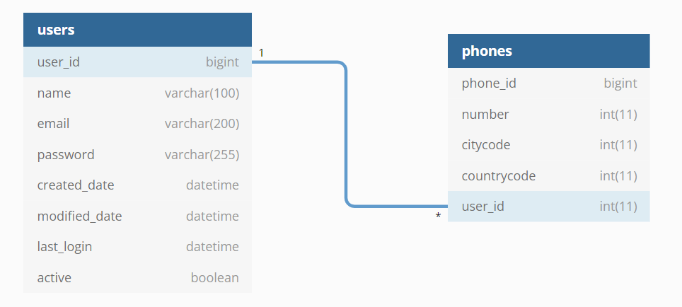
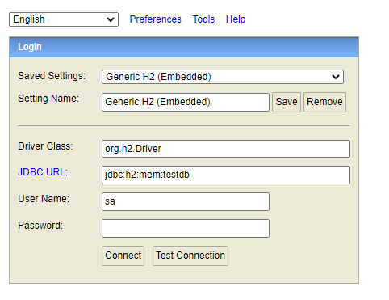

# UserAPI
Esta es una API RESTful de creacion de usuarios

#### Diagrama de la base de datos

#### H2
http://localhost:8080/h2-console

 * Para que vean las tablas de la BD pueden ingresar al H2 con los datos en la imagen (la contraseña es "password" sin comillas)

http://localhost:8080/api/users

POST
   - SaveUser (JSON)
 
GET
   - All User
   - Find By Id (http://localhost:8080/api/users/{id})

PUT
  - Update User (http://localhost:8080/api/users/{id}) + JSON

DELETE
- Delete User (http://localhost:8080/api/users/{id})

Pueden ver la coleccion de pruebas en Postman
https://www.postman.com/speeding-shadow-810108/workspace/userapi/collection/20268827-e511d7f9-9acf-4c94-a0c5-3af00981039c?action=share&creator=20268827

Mediante metodo POST pueden crear este usuario

    {       
    "name": "Juan Rodriguez",
    "email": "juan@rodriguez.org",
    "password": "Hunter2$",
    "phones": [
        {                
        "number": 1234567,
        "citycode": 1,
        "countrycode": 57
        },
        {               
        "number": 966605535,
        "citycode": 9,
        "countrycode": 56
        }
    ],
    "active": true
    }

# Detalle de los Sistemas
Java 8 Spring-Boot 2.6.6
Base de datos H2
Maven 4

# Compilar y ejecutar
Para copilar el proyecto se requiere Java y Maven instalado. Ingresar al directorio 'UserAPI' y ejecutar el siguiente comando maven:

    mvn package

Luego de compilar el proyecto ingresar al directorio target ejecutar el siguiente comando java:

    java -jar .\UserAPI-1.0-SNAPSHOT.jar

# Consumo del servicio

Para consumir el servicio se debe ejecutar el siguiente comando a traves de una terminal o pueden tambien ver la coleccion de pruebas en Postman (recomendado)
https://www.postman.com/speeding-shadow-810108/workspace/userapi/collection/20268827-e511d7f9-9acf-4c94-a0c5-3af00981039c?action=share&creator=20268827
:

	curl --header "Content-Type: application/json" \
    --request POST \
    --data '{"name": "Juan Rodriguez", "email": "juan@rodriguez.org", "password": "Hunter2$", "phones": [{ "number": 1234567, "citycode": 1, "countrycode": 57 }, { "number": 966605535, "citycode": 9, "countrycode": 56 }], "active": true}' \
    http://localhost:8080/api/users
